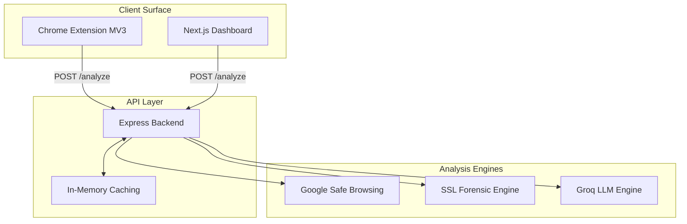
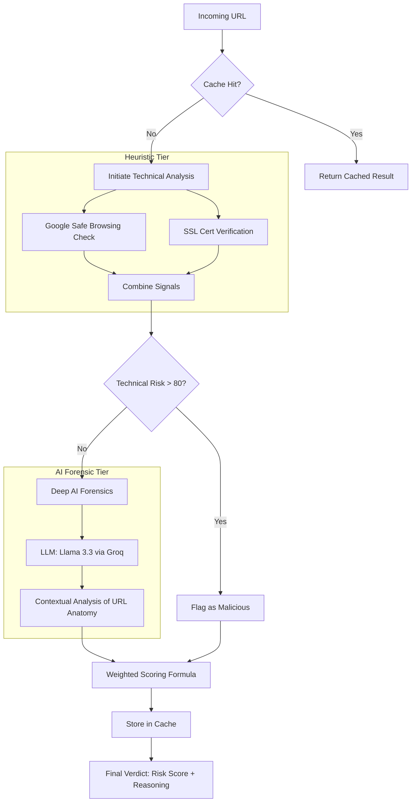

<div align="center">
  
  <h1 style="font-size: 3.5rem; margin-bottom: 0;">Fish-Pish</h1>
  <p><strong>Advanced Phishing Detection & Awareness Ecosystem</strong></p>
</div>

**Fish-Pish** is a production-grade cybersecurity platform designed to shield users from phishing attacks through a combination of real-time heuristic analysis and AI-driven forensic evaluation. The ecosystem comprises a **Chromium Extension**, a **Next.js Education Dashboard**, and an **AI-Powered Backend**.

---

## 🏗️ System Architecture[FISH PISH EXTENSION]

The Fish-Pish ecosystem is built on a modular, high-performance architecture optimized for low-latency analysis and high-accuracy detection.



---

## 🧠 Backend Logic Architecture (Analysis Engine)

The backend employs a multi-stage weighted scoring engine to evaluate URL risk. It transitions from fast technical checks to deep AI forensics.



### ⚖️ Weighted Analysis Logic:
- **Google Safe Browsing**: Primary threat signal. A match results in an immediate **+80 score**.
- **SSL Analysis**: Scores based on certificate health:
    - `Non-Secure (HTTP)`: +20
    - `Self-Signed`: +15
    - `Recently Issued (<7 days)`: +10
- **AI Deep Forensic**: The LLM analyzes the URL string, path keywords (e.g., `login`, `verify`), and typosquatting.
    - **Dynamic Weighting**: If technical signals are low (<80), the AI verdict carries **70% of the total weight** to detect zero-day phishing sites that haven't hit blacklists yet.

---

## 🖥️ Frontend & Education Modules

The dashboard is a comprehensive **Next.js 15** application that gamifies cybersecurity education and provides real-time testing tools.

### 1. 🎓 Learning Hub
An immersive repository of cybersecurity best practices, covering topics from password hygiene to advanced social engineering tactics.

### 2. 📝 Interactive Quiz Module (Deep Dive)
The core assessment engine designed to certify user awareness.
- **Dynamic Categories**: Cyber Hygiene, Phishing Defense, Social Engineering, and Mobile/IoT Safety.
- **Logic Engine**: 
    - Real-time scoring and validation.
    - Detailed explanations for every answer to reinforce learning.
    - **80% Passing Threshold**: Users must demonstrate high proficiency to earn achievements.
- **Gamification**: Earn the **"Security Scholar"** badge and track progress across modules.

### 3. 🛠️ Security Tools & Interactive Demo
- **Live Link Analyzer**: A web-based interface to the backend engine for manual URL audits.
- **Simulation Playground**: A dedicated demo area where users can see how the Link Guardian extension reacts to various threat levels without visiting actual malicious sites.

### 4. 🤖 AI Doubts Assistant
Integrated 24/7 chatbot that provides contextual cybersecurity advice and explains complex terminology to users in real-time.

### 5. 📊 Visual Awareness
Interactive components (`WhyAwareness`) utilizing data-driven storytelling to highlight the escalating risks of the digital landscape.

---

## 🧩 Chrome Extension (The Link Guardian)

The extension provides "Last-Mile" protection by sitting between the user and the malicious link.
- **Shadow DOM Injection**: Ensures a consistent, tamper-proof UI that doesn't conflict with website styles.
- **Hover Forensics**: Triggers a detailed risk analysis popup on link hover, providing a verdict before the user clicks.
- **Visual Risk Triage**:
    - 🔴 **Danger**: High probability of phishing (Score > 75).
    - 🟡 **Suspicious**: Use caution (Score > 40).
    - 🟢 **Safe**: Low risk detected.

---

## 🚀 Tech Stack

- **Frontend**: Next.js 15 (App Router), Tailwind CSS, Framer Motion, Lucide React.
- **Backend**: Node.js, Express, TypeScript.
- **AI**: Groq SDK (Llama 3.3-70B model).
- **Security Checkers**: Google Safe Browsing API, custom SSL forensic engine.
- **Extension**: Vite, TypeScript, Manifest V3.

---

## 🛠️ Installation & Setup

### 1. Backend Configuration
Navigate to `/backend` and create a `.env` file:
```env
PORT=8000
GOOGLE_SAFE_BROWSING_API_KEY=your_key
GROQ_API_KEY=your_key
```

### 2. Run the Ecosystem
```bash
# Install root dependencies
npm install

# Start Backend API
npm run dev -w backend

# Start Dashboard
npm run dev -w frontend

# Build Extensiondist
npm run build -w extension
```

---

## 🏁 Deployment
- **Backend**: Hugging Face Spaces / Render.
- **Frontend**: Vercel.
- **Extension**: Load `extension/dist` into Chrome via **Load Unpacked**.